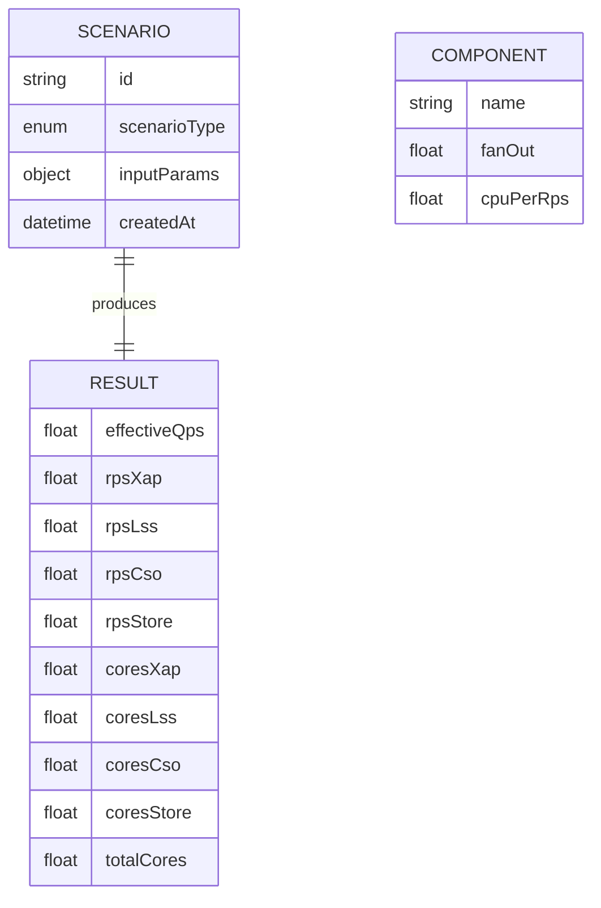

# Copilot CPU Estimation Portal — Design Specification

## 1. Document Control
- Version: 0.1.0 (Draft)
- Date: 2025-09-15
- Source Requirements: `doc/requirements.txt`
- Owner: (assign)

## 2. Overview
A web-based interactive portal for estimating CPU (cores) consumption across different evaluation scenarios of Copilot (Offline A/B, Shadow A/B, Online A/B delta) and standard usage (Inorganic growth). The tool converts business or experiment parameters into effective QPS, propagates request fan-out across components (XAP, LSS, CSO, Store), and computes per-component and total CPU requirements. It also provides an RPS chain breakdown and supports future memory estimation.

## 3. Goals & Non-Goals
### Goals
- Rapid, interactive what-if modeling for engineering & capacity planning.
- Consistent calculation logic with transparent formulas.
- Ability to compare scenarios and export results.
- Extensible foundation for future auto-fetch (Kusto / Jarvis) defaults.

### Non-Goals (v1)
- Live integration with production metrics or Kusto APIs.
- Authentication / RBAC (assume internal trusted environment or static hosting).
- Persistence of scenarios across sessions (local storage optional nice-to-have).
- Real-time collaboration.

## 4. Primary Use Cases
| ID | Actor | Scenario | Outcome |
|----|-------|----------|---------|
| UC-1 | Capacity Planner | Estimate CPU for a new Shadow A/B plan | Total cores per component |
| UC-2 | Engineer | Tune fork parameters to fit existing cluster capacity | Adjusted core totals |
| UC-3 | Product Analyst | Evaluate added load from Online A/B delta | Additional peak cores |
| UC-4 | Strategy | Project inorganic growth impact | Incremental peak cores |
| UC-5 | Engineer | Export calculation for review | Download CSV/JSON |
| UC-6 | Analyst | Cross-compare 2–3 scenarios | Side-by-side view (stretch) |

## 5. Functional Requirements
| Ref | Requirement |
|-----|-------------|
| FR-1 | Provide scenario selection tabs: Offline, Shadow, Online, Inorganic Growth |
| FR-2 | Accept all parameter inputs defined in requirements spec with defaults |
| FR-3 | Validate numeric & domain constraints (ranges, > 0, 0–1 factors) |
| FR-4 | Compute Effective QPS per scenario using defined formulas |
| FR-5 | Apply fan-out chain to derive RPS per component |
| FR-6 | Compute CPU cores per component using cores/RPS coefficients |
| FR-7 | Aggregate total CPU cores |
| FR-8 | Display results (table + chart) |
| FR-9 | Allow export to CSV & JSON |
| FR-10 | Provide form reset and per-scenario recompute |
| FR-11 | Support optional advanced panel for overriding fan-out & cores/RPS |
| FR-12 | (Ext) Provide memory estimates placeholders if coefficients added |
| FR-13 | (Ext) Provide scenario duplication / comparison (phase 2) |

## 6. Non-Functional Requirements
| Category | Requirement |
|----------|-------------|
| Performance | Single computation < 10 ms client-side |
| Availability | Static site (no backend) > 99% (host via GitHub Pages/Azure SWA) |
| Usability | All inputs reachable via keyboard; accessible labels |
| Accessibility | WCAG 2.1 AA contrast & ARIA labels for dynamic results |
| Security | No PII; no external calls in v1 |
| Portability | Pure front-end bundle (no external runtime dependency) |
| Extensibility | Modular calculation service and schema-driven forms |

## 7. Domain Model
### Entities / Concepts
- Scenario (type, input parameters, derived metrics, timestamp)
- Component (XAP, LSS, CSO, Store) with fan-out multiplier and CPU-per-RPS coefficient
- CalculationResult (effectiveQps, rpsChain, componentCores[], totalCores)

### Relationships
- Scenario has one CalculationResult.
- Scenario references set of Components (configured constants or overrides).

## 8. Data Model (Logical)


## 9. Input Validation Rules
| Field | Constraints | Error Message |
|-------|-------------|---------------|
| Queries per Month | > 0 | Must be > 0 |
| Workdays per Month | > 0 and ≤ 31 | Invalid workdays |
| Active Hours per Day | > 0 and ≤ 24 | Invalid active hours |
| Live Baseline QPS | ≥ 0 | Must be ≥ 0 |
| Fork % | 0–100 | Fork % must be between 0 and 100 |
| Fork Count | integer ≥ 1 | Fork count must be ≥ 1 |
| Treatment Share | 0–1 | Must be in [0,1] |
| Delta Factor | 0–1 | Must be in [0,1] |
| ΔMAU | ≥ 0 | Must be ≥ 0 |
| DAU/MAU Ratio | 0–1 | Must be in [0,1] |
| QPD | ≥ 0 | Must be ≥ 0 |
| Realization Factor ρ | 0–1 | Must be in [0,1] |
| PCF | > 0 | Must be > 0 |
| Fan-out values | > 0 | Must be > 0 |
| cores/RPS values | > 0 | Must be > 0 |

## 10. Calculation Logic (Normalized)
### 10.1 Offline A/B (SEVAL)
```
QPS = QPM / (Workdays * ActiveHours * 3600)
```
### 10.2 Shadow A/B
```
QPS_delta = LiveBaselineQPS * (ForkPercent / 100) * ForkCount
```
### 10.3 Online A/B (delta)
```
QPS_delta = LiveBaselineQPS * TreatmentShare * DeltaFactor
```
### 10.4 Inorganic Growth
```
PeakQPS = ((DeltaDAU * QPD * RealizationFactor) / 86400) * PCF
```
### 10.5 Fan-out RPS Chain
Let baseQps = scenarioEffectiveQps.
```
RPS_XAP = baseQps
RPS_LSS = RPS_XAP * fanout_XAP_LSS
RPS_CSO = RPS_LSS * fanout_LSS_CSO
RPS_STORE = RPS_CSO * fanout_CSO_STORE
```
### 10.6 CPU per Component
```
cores_XAP = RPS_XAP * cpuPerRps_XAP
cores_LSS = RPS_LSS * cpuPerRps_LSS
cores_CSO = RPS_CSO * cpuPerRps_CSO
cores_STORE = RPS_STORE * cpuPerRps_STORE
TotalCores = sum(cores_*)
```
### 10.7 Memory (Future)
Add: `memoryPerRps_*` analogous to cpuPerRps.

## 11. Architecture
### v1 (All Client-Side)
- **UI Layer**: React (CRA / Vite) or vanilla modular JS.
- **State Management**: Simple React hooks or a lightweight store (Zustand) if needed.
- **Computation Module**: Pure functions (no side effects). Exports `calculateScenario(scenarioInput)`.
- **Export Module**: Utility to serialize result to CSV/JSON.

### Future v2 (Optional Backend)
- Add `/defaults` API pulling real-time coefficients.
- Add `/history` for saving scenarios.

### Component Diagram (Textual)
```
[User] -> [UI Forms] -> [Validation] -> [Calculation Service] -> [Result Renderer]
                                     -> [Export Utility]
```

## 12. Module Breakdown
| Module | Responsibility |
|--------|----------------|
| forms/ | Input components & validation messages |
| calc/ | Core formulas, unit conversions, fan-out chain |
| models/ | Type definitions & schema |
| ui/ | Result table, charts, tabs |
| export/ | CSV / JSON serialization |
| theme/ | Style tokens |

## 13. API (Hypothetical Future)
| Endpoint | Method | Body | Response |
|----------|-------|------|----------|
| /calculate | POST | ScenarioInput JSON | CalculationResult |
| /defaults | GET | — | Default coefficients |

## 14. UI / UX Design
### Layout
- Top: Scenario Tabs
- Left Panel: Inputs (grouped by section)
- Right Panel: Results (table + donut/bar chart)
- Footer: Export buttons + version link

### Accessibility
- All inputs use `<label for>` associations.
- Results area has ARIA live region (polite) after compute.

## 15. Error Handling Strategy
- Inline per-field validation (on blur & on compute).
- Aggregate banner if compute fails.
- Fallback to safe defaults when optional coefficients missing; display warning.

## 16. Testing Strategy
| Layer | Tests |
|-------|-------|
| Unit | Formula correctness (edge: zero values, boundaries 0/1) |
| Unit | Fan-out propagation |
| Unit | CSV/JSON export formatting |
| Component | Form validation & error messages |
| Integration | Scenario end-to-end compute (sample fixtures) |
| Regression | Snapshot of derived table for canonical inputs |

### Sample Unit Test Cases
1. Offline: QPM=1000, Workdays=20, Hours=5 → QPS ≈ 1000/(20*5*3600)
2. Shadow: Baseline=2000, Fork%=20, Count=2 → QPS=2000*0.2*2=800
3. Online: Baseline=3000, Share=0.5, Delta=0.1 → QPS=150
4. Inorganic: ΔMAU=10000, QPD=2.4, ρ=0.85, PCF=6 → PeakQPS=((10000*2.4*0.85)/86400)*6
5. Fan-out chain with all fan-outs=1 leaves RPS unchanged.

## 17. Performance Considerations
- Computation O(1); dominated by rendering. No need for web workers.
- Debounce compute if adding live recalculation later (e.g., 250 ms).

## 18. Security Considerations
- No external calls → minimal risk.
- Sanitize numbers (prevent scientific notation injection in display—format to fixed range).

## 19. Extensibility Hooks
- Add plug-in registry for components (array of {name, fanOutKey, cpuKey}).
- Support dynamic addition of memory metrics via schema extension.

## 20. Deployment Plan (v1)
1. Implement pure front-end (Vite + React + TypeScript recommended).
2. Build static bundle → `dist/`.
3. Host on GitHub Pages or Azure Static Web Apps.
4. Tag version in repo (e.g., `portal-v0.1.0`).

## 21. Implementation Phases
| Phase | Scope |
|-------|-------|
| P1 | Core formulas + single scenario UI + table output |
| P2 | Charts + export + validation polish |
| P3 | Scenario duplication / comparison view |
| P4 | Optional backend defaults & memory metrics |

## 22. Open Questions
1. Should we support saving scenarios locally (localStorage) in P1?
2. Are memory coefficients available or standardized yet?
3. Do we need multi-region adjustments (latency factors) later?
4. Should export include raw inputs, derived RPS, and version metadata? (Assumed yes.)

## 23. Risks & Mitigations
| Risk | Impact | Mitigation |
|------|--------|-----------|
| Incorrect coefficient defaults | Bad capacity planning | Add unit test fixtures & highlight source of defaults |
| User misinterprets delta vs absolute QPS | Over/under provisioning | Provide inline helper text per scenario |
| Scope creep into backend early | Delays | Enforce phased delivery |

## 24. JSON Schema (Scenario Input)
```json
{
  "$schema": "https://json-schema.org/draft/2020-12/schema",
  "$id": "https://example.org/schemas/cpu-scenario.json",
  "title": "ScenarioInput",
  "type": "object",
  "required": ["scenarioType", "parameters", "coefficients"],
  "properties": {
    "scenarioType": {
      "type": "string",
      "enum": ["offline_ab", "shadow_ab", "online_ab_delta", "inorganic_growth"]
    },
    "parameters": {
      "type": "object",
      "properties": {
        "queriesPerMonth": {"type": "number", "minimum": 0},
        "workdaysPerMonth": {"type": "number", "exclusiveMinimum": 0},
        "activeHoursPerDay": {"type": "number", "exclusiveMinimum": 0, "maximum": 24},
        "liveBaselineQps": {"type": "number", "minimum": 0},
        "forkPercent": {"type": "number", "minimum": 0, "maximum": 100},
        "forkCount": {"type": "integer", "minimum": 1},
        "treatmentShare": {"type": "number", "minimum": 0, "maximum": 1},
        "deltaFactor": {"type": "number", "minimum": 0, "maximum": 1},
        "deltaMau": {"type": "number", "minimum": 0},
        "dauMauRatio": {"type": "number", "minimum": 0, "maximum": 1},
        "qpd": {"type": "number", "minimum": 0},
        "realizationFactor": {"type": "number", "minimum": 0, "maximum": 1},
        "pcf": {"type": "number", "exclusiveMinimum": 0}
      },
      "additionalProperties": false
    },
    "coefficients": {
      "type": "object",
      "properties": {
        "fanout": {
          "type": "object",
          "properties": {
            "xap_lss": {"type": "number", "exclusiveMinimum": 0},
            "lss_cso": {"type": "number", "exclusiveMinimum": 0},
            "cso_store": {"type": "number", "exclusiveMinimum": 0}
          },
          "required": ["xap_lss", "lss_cso", "cso_store"],
          "additionalProperties": false
        },
        "cpuPerRps": {
          "type": "object",
          "properties": {
            "xap": {"type": "number", "exclusiveMinimum": 0},
            "lss": {"type": "number", "exclusiveMinimum": 0},
            "cso": {"type": "number", "exclusiveMinimum": 0},
            "store": {"type": "number", "exclusiveMinimum": 0}
          },
          "required": ["xap", "lss", "cso", "store"],
          "additionalProperties": false
        }
      },
      "required": ["fanout", "cpuPerRps"],
      "additionalProperties": false
    }
  },
  "additionalProperties": false
}
```

## 25. Example Calculation (Illustrative)
Input (Shadow A/B):
```
LiveBaselineQps = 2000
ForkPercent = 20
ForkCount = 2
Fan-outs = 1,1,1
CPU/RPS = 0.01, 0.02, 0.015, 0.005 (XAP, LSS, CSO, Store)
```
Steps:
```
QPS_delta = 2000 * 0.20 * 2 = 800
RPS_XAP = 800
RPS_LSS = 800
RPS_CSO = 800
RPS_STORE = 800
cores_XAP = 800 * 0.01 = 8
cores_LSS = 800 * 0.02 = 16
cores_CSO = 800 * 0.015 = 12
cores_STORE = 800 * 0.005 = 4
Total = 40 cores
```

## 26. Acceptance Criteria
- Given valid inputs, system displays total cores and per-component cores.
- Invalid inputs produce inline error states without crashing.
- Export JSON contains original inputs + computed outputs + schema version.
- All core formula unit tests pass (100% branch coverage of calc module).

## 27. Maintenance Notes
- Centralize constants (defaults) in one module.
- Bump schema `$id` and version on structural changes.

---
Prepared from `doc/requirements.txt`. Update this spec as requirements evolve.
